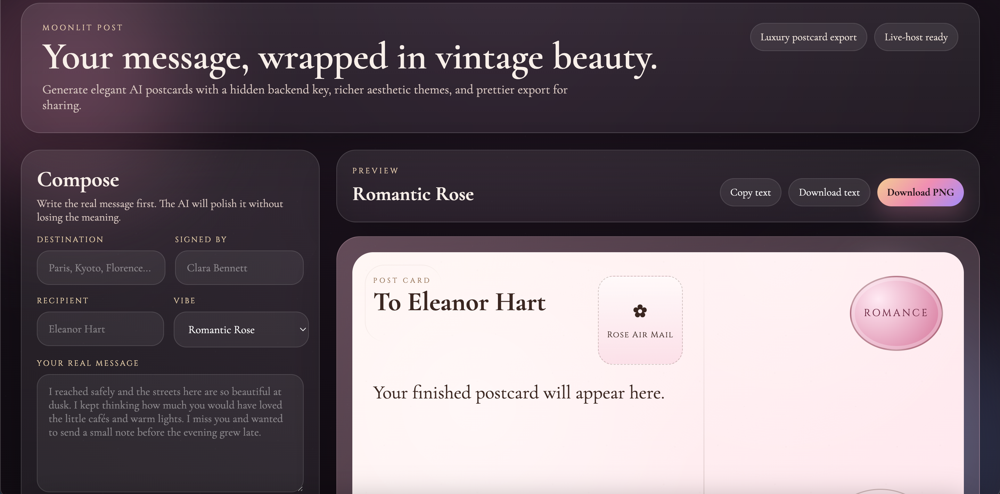
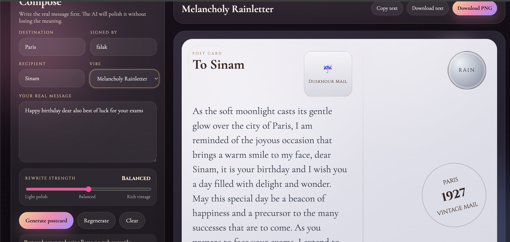
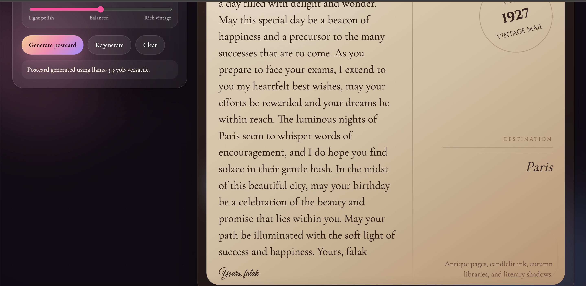
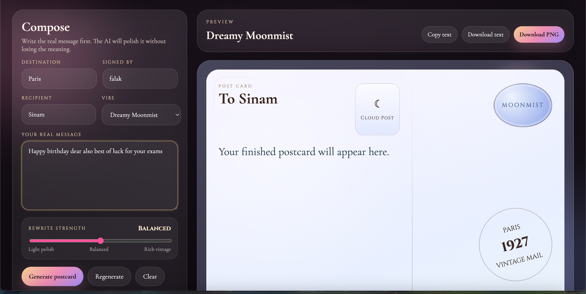
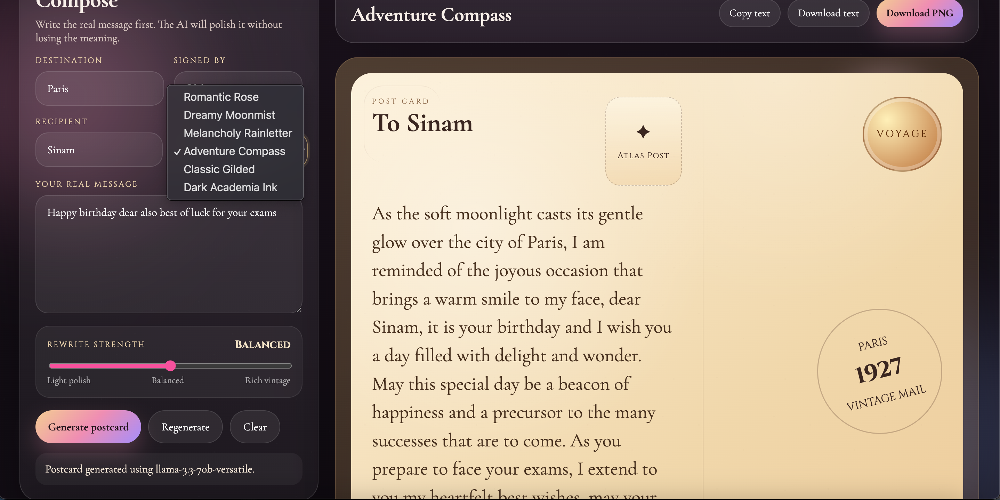

# 🌙 Luxury Postcard — AI Aesthetic Message Generator

Luxury Postcard is a visually rich web app that generates beautifully styled, mood-based digital postcards using AI-inspired prompts.

---

## ✨ Features

* Mood-based message generation (romantic, poetic, calm, dark, etc.)
* Beautiful aesthetic UI with soft animations
* Export/share styled postcards
* Works instantly in browser (no install)

---

## 🌐 Live Demo

https://falak8484.github.io/luxury-postcard/

---

## 🚀 How to Use

1. Open the website
2. Enter your message or prompt
3. Choose a mood/style
4. Generate your postcard
5. Export or share

---

## 🧠 What This Project Shows

* UI/UX design + aesthetics
* Frontend logic and state handling
* Creative AI-inspired product thinking

---

## 📸 Screenshots

---

## 🧑‍💻 Author

Falak Shaikh
B.Tech Computer Science (Cyber Security)
